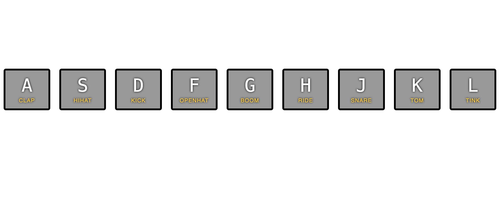

# [01 - JavaScript Drum Kit](https://javascript30.com)

## Challenge

- Hit key play a audio sound.
- Each key plays a short animation when hit.
- Keys can be hit continuously, and sound will play with each hit.

## What I learn

### [`<kbd>`](https://developer.mozilla.org/en-US/docs/Web/HTML/Element/kbd)

The `<kbd>` element in HTML is used to represent user input, typically keyboard input. It is often used to display keyboard shortcuts or commands in a way that distinguishes them from regular text.

### `data-*` [data attributes](https://developer.mozilla.org/en-US/docs/Learn/HTML/Howto/Use_data_attributes)

- data-\* attributes allow us to store extra information on standard, semantic HTML elements
- read out via a `dataset` property in JS
- access them from CSS

### key code

- [Key Code lookup Website](https://www.toptal.com/developers/keycode)
- The keyCode property is deprecated because it is inconsistent across different browsers and does not support all modern keys. Instead, you should use the `key` or `code` properties of the KeyboardEvent object.

### key can be hit continuously, and sound will play with each hit.

- set the audio to start every time we hit the key, so key can be hit continuously, and sound will play with each hit.
- if not set the audio to the start, when we hit the key again when the audio is playing, as the audio is already playing, browser will do nothing

### remove the class `playing`, using [transitionend event](https://developer.mozilla.org/en-US/docs/Web/API/Element/transitionend_event)

- it can be removed with setTimeout, but it need to keep in sync with the css timer (transition: all 0.07s), changing one place will require changing in other place
- we add a event listener to each of the keys
- each key, there is more than one TransitionEvent, so we pick the longest one, "transform"
- after transform end we remove the `playing` class
- we also have [AnimationEnd](https://developer.mozilla.org/en-US/docs/Web/API/Element/animationend_event)

## Step by Step

- add class `playing` to the div when we hit a key that matches the data-key attribute on that div, run animation there.
- play audio when we hit a key that has a audio that matches it data-key attribute.
- remove class `playing` to the div when we hit a key, so it return to how it look when it start.
   

1. make the browser listen to key press
2. link the specific audio to the key
   - select a audio element with data-key, correspond to the key press
   - find out whether the key press has a corresponding audio file
   - return if that key don't have an audio
   - play sound
   - set the audio to start, so key can be hit continuously, and sound will play with each hit.
3. link the specific key to the key press for animation
   - get the key element with data-key, correspond to the key press
   - add class `playing` to the key element
4. remove the class `playing` with transitionend event
   - get all the keys
   - add eventListener with listening transitionend event to each key
   - remove the `playing` class
